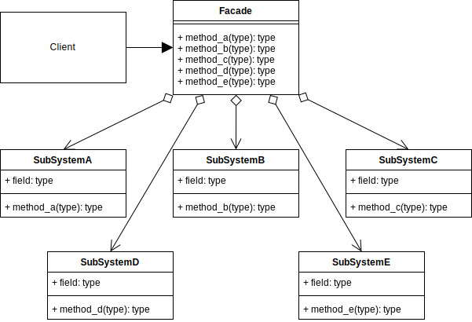

# Facade

That provides a simplified **interface** to a larger body of code, such as a library or complex subsystem.

The pattern involves creating a simple **interface** that hides the **complexity** of the underlying system and provides
a set
of methods that clients can use to interact with the system.

 

The **Facade** pattern is often used to:

1. **simplify** the interface to a complex system

2. making it **easier** to use and reducing the amount of code that a client needs to write.

3. It is also useful for **decoupling clients** from the implementation details of
   a system, allowing the system to evolve without affecting its clients.

 

In the Facade pattern, a single class (the facade) provides a simplified interface to a complex subsystem, which may
consist of multiple classes and interfaces. The facade encapsulates the complexity of the subsystem and exposes a
simple, **high-level** interface that clients can use to interact with the system.

<h3>benefits</h3>

1. Simplifying the interface to a complex system, making it easier to use.
2. Encapsulating the complexity of a system, making it easier to modify and maintain.
3. Decoupling clients from the implementation details of a system, allowing the system to evolve without affecting its
   clients.
4. Promoting code reuse by providing a single interface to a complex subsystem.

<h3>Disadvantage</h3>

1. **Reduced flexibility**: By providing a simplified interface to a complex system, the Facade pattern can limit the
   flexibility of the system. Clients may only be able to perform certain tasks through the Facade, which means they may
   need to modify the Facade or access the underlying system directly to perform more complex operations.

2. **Increased coupling**: The Facade pattern can increase the coupling between the client and the subsystem, as the client is
now dependent on the Facade to interact with the system. Changes to the Facade or the underlying system may require
changes to the client code, which can lead to maintenance issues.

3. **Limited extensibility**: The Facade pattern is designed to simplify the interface to a complex system, but it may not be
suitable for systems that need to be highly extensible or configurable. Adding new functionality to the system may
require changes to the Facade, which can lead to maintenance issues and increased complexity.

4. **Additional overhead**: The Facade pattern introduces an additional layer of abstraction between the client and the
subsystem, which can add overhead to the system. Depending on the complexity of the system and the number of clients
using the Facade, this overhead can become significant.
